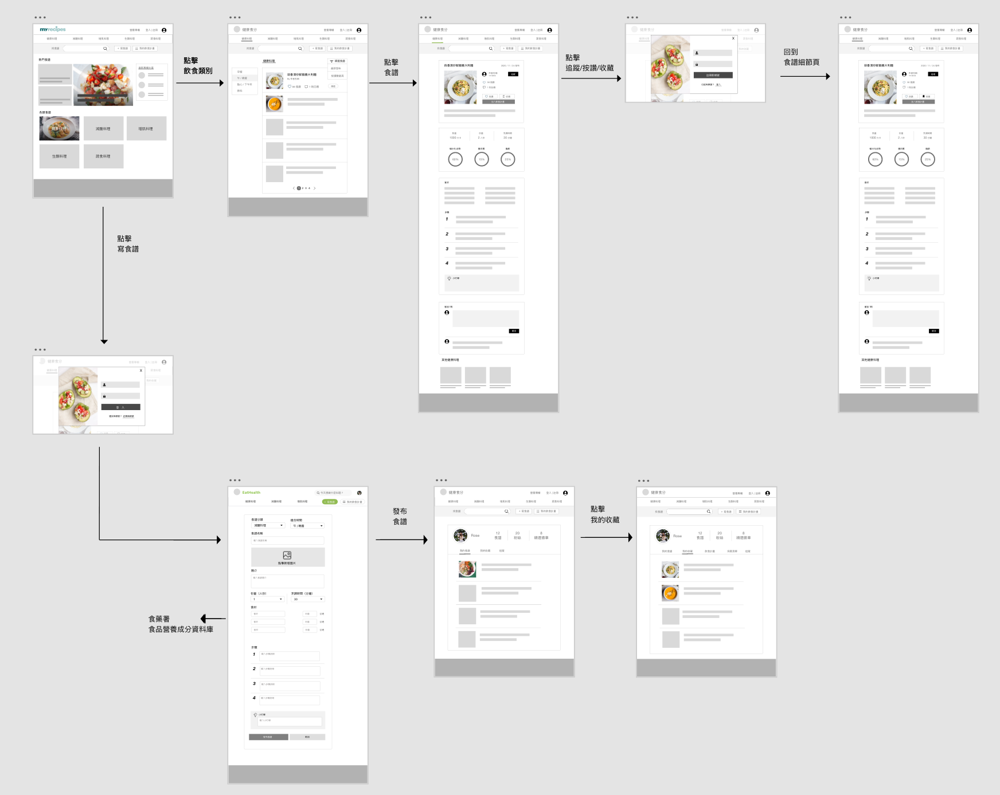

# EatHealth 健康食分 
A social platform for **sharing healthy recipes**, which helps users achieve their diet goals more successfully by **delivering nutritional facts of foods** and **creating an online community** that users can 
like and comment on recipe posts, add to favorites, and follow authors.

## Demo
- Link: https://eatwell-a0ca6.web.app/
- Test account
    - E-mail: test@test.test
    - Password: 123456
## Technologies
- Front-End Fundamental
    - HTML / CSS / JavaScript
    - SCSS
    - Responsive Web Design (RWD)
- Front-End Libraries
    - React Hook
    - React Router
- Cloud services
    - Google Firebase Firestore
    - Google Firebase Storage
    - Google Firebase Authentication
    - Google Firebase Hosting
- Third party packages
    - [React Select](https://www.npmjs.com/package/react-select)
    - [React Minimal Pie Chart](https://www.npmjs.com/package/react-minimal-pie-chart)
    - [React Multi Carousel](https://www.npmjs.com/package/react-multi-carousel)
## User Flow
### Flow Chart

### Wireflow

## Features
### 1. Filter recipes by different diet goals and mealtime

### 2. Like recipe posts / Add recipes to favorite list / Follow authors

### 3. Upload recipe with multiple photos and details

### 4. Comment on recipes/ Delete comments

 

## Future Features
- Allow users to add ingredients that are not in Taiwan Food Nutrition Databse 
- Edit/Delete recipes
- Pagination
## Contact
E-mail: b506104062@tmu.edu.tw

